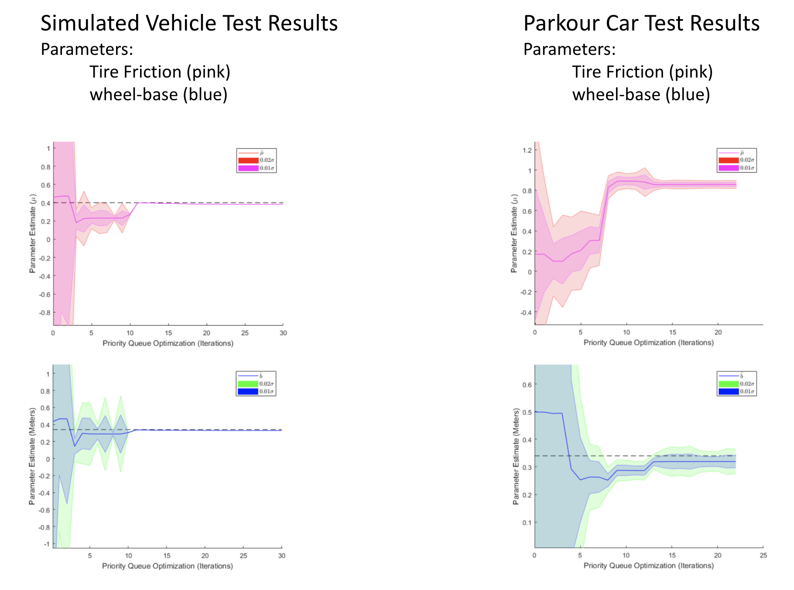

# spirit
spirit is a wrapper around Bullet Physics engine with integrated control and planning algorithms. spirit has been used in numerous projects at [ARPG lab](https://github.com/arpg). Spirit uses Pangolin and SceneGraph to spawn a lightweight interactive 3D gui for debugging purpuses.

spirit controllers can run both in its simulator and physical robot

Controller on simulated model | Controller on physical vehicle
:---:|:---:
 | 

spirit has a local planning algorithm which can plan between given waypoints with parameterized trajectories (bezier curves) in state space. A given sequence of waypoints might be reachable for the robot and if not the most optimal solution would be generated.

here is an example of local planner in three different scenarios

Reachable waypoint | Unreachable waypoint (due to low friction) | Unreachable waypoint (high target velocity)
:---:|:---:|:---:
 |  | 

an MPC method which uses bullet physics engine as the underlying model can use the trajectories from local planner to stabilize the vehicle to desired trajectory. This MPC method runs on multiple threads to speed up the optimization calculations

there is also a sampling based MPC implementation which has been tested on physical hardware

vehicle trajectories generated by spirit has been used in [this](https://arxiv.org/pdf/1804.05288) paper to synthesize control funnel functions with convergence guarantees (Paper columns show funnel boundaries)

spirit also has been used to do online system identification (Paper is [here](https://drive.google.com/file/d/1e_na0XphNV94-4GD3n--loKTag8jLaAM/view?usp=sharing)).
here are some results for estimating friction coefficent and wheel-base in simulation and physical experiments(both using spirit)

## Dependencie
- Eigen3
- [HAL](https://github.com/arpg/HAL) : if examples used
- [Pangolin](https://github.com/arpg/Pangolin)
- [SceneGraph](https://github.com/arpg/SceneGraph)
- [Bullet2.84](https://github.com/bulletphysics/bullet3/archive/2.84.zip)
- [ceres-solver](https://github.com/ceres-solver/ceres-solver)

## Examples
- sim_car : application showing simple vehicle simulation on flat ground
- bvp_example : simple boundary value solver example showing a local planning problem between two waypoints
- car_robot : application to test internals of spirit
- car_calib : application to calibrate vehicle parameters (requires arpg's parkour car robot to run)
-  gamepad_drive : application to drive parkour car with a gamepad (requires arpg's parkour car robot to run)
-  mpc_car : application using spirit's internal mpc controller (requires arpg's parkour car robot to run)

## Developers
- [Sina Aghli](https://sinaaghli.com/)

## Publications
- Sina Aghli and Christoffer Heckman, “Online System Identification and Calibration of Dynamic Models for Autonomous Ground Vehicles” IEEE International Conference On Robotics and Automation 2018
- H Ravanbakhsh, S Aghli, C Heckman, S Sankaranarayanan, “Path-Following though Control Lyapunov Functions” International Conference on Intelligent Robots 2018

